# WhatsApp Girlfriend - Emily

## Description
Emily is a virtual girlfriend chatbot that interacts with you on WhatsApp. The project utilizes Ngrok, Twilio, and a custom-built codebase to set up and run the chatbot.

## Features
- Real-time WhatsApp conversations with Emily.
- Emily responds like a girlfriend for a realistic chat experience.
- Uses Twilio for WhatsApp API integration.
- Ngrok for tunneling local servers to the internet.
- Custom-built chatbot code.

## Installation
### Prerequisites
- Twilio account with WhatsApp sandbox setup.
- Ngrok installed and configured on your device.
- Python environment with necessary dependencies.

### Steps to Install
1. Clone the repository:
   ```bash
   git clone https://github.com/Mayank-MSJ-Singh/Whatsapp-AI-Chat.git
   ```
2. Navigate to the project directory:
   ```bash
   cd Whatsapp-AI-Chat
   ```
3. Install dependencies:
   ```bash
   pip install -r requirements.txt
   ```
4. Set up Ngrok on your device and start it:
   ```bash
   ngrok http --domain=exciting-witty-dogfish.ngrok-free.app 8080
   ```
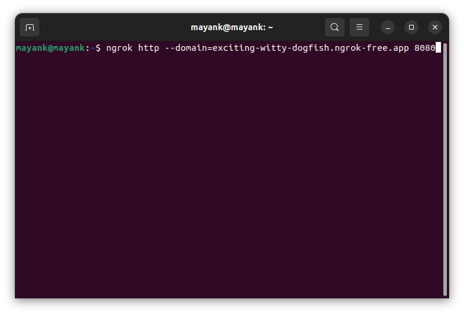
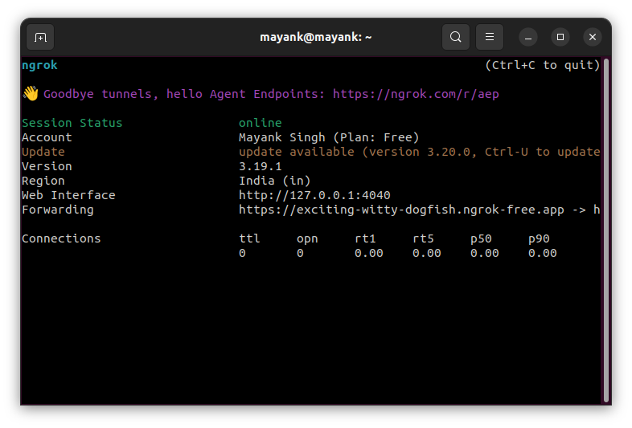

5. Copy The Link as shown in the Image:
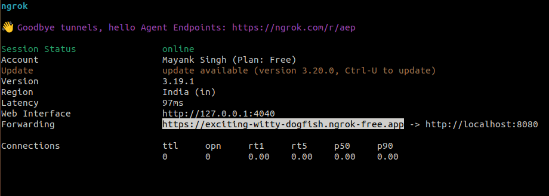


### Twilio Setup
- Go to Twilio.
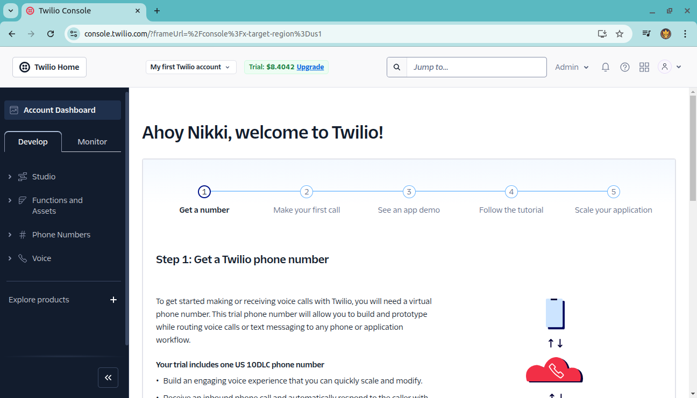
- Click on "Explore Product," then select "Try WhatsApp."
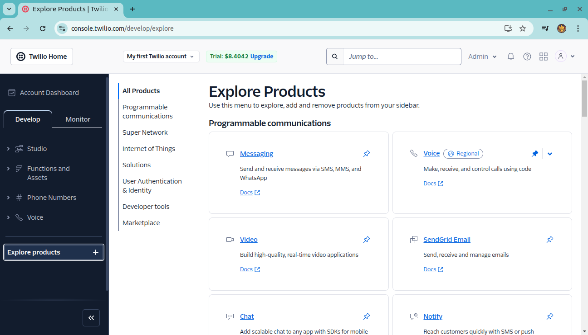

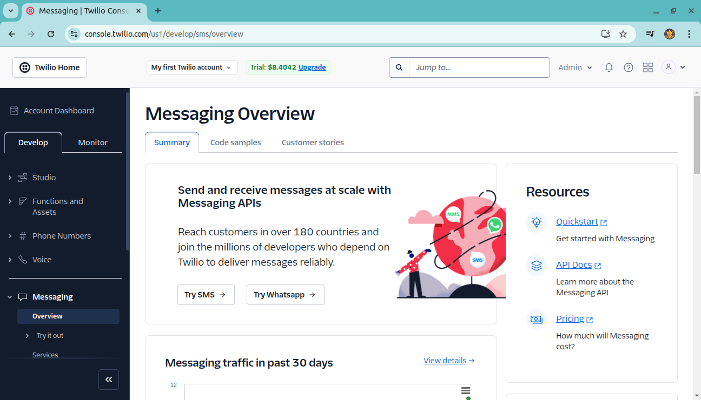
- Scan the QR code or send the message `'join live-refer'` to the given number.
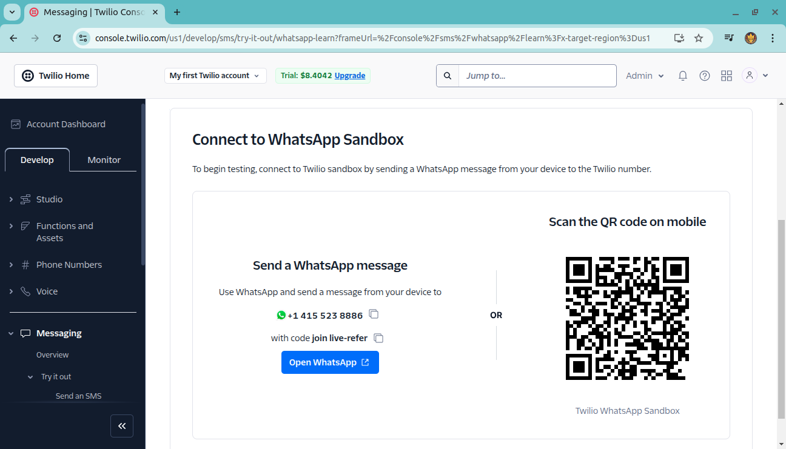
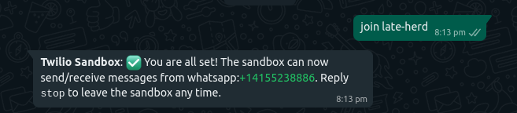
- Go to "Sandbox Settings" and paste the copied link as shown on the screen.
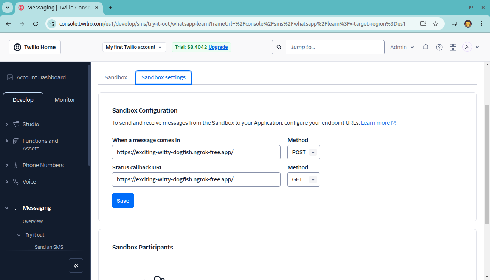


### Running the Chatbot
After setting up Twilio, run Ngrok in the terminal using:
   ```bash
   ngrok http --domain=exciting-witty-dogfish.ngrok-free.app 8080
   ```
Then start the chatbot:
   ```bash
   python main.py
   ```

Now Chat!
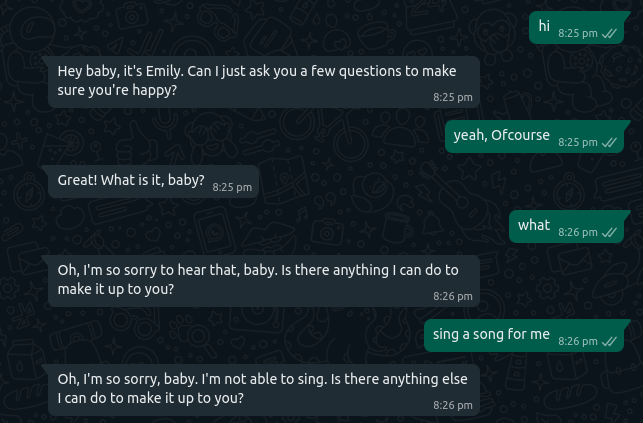


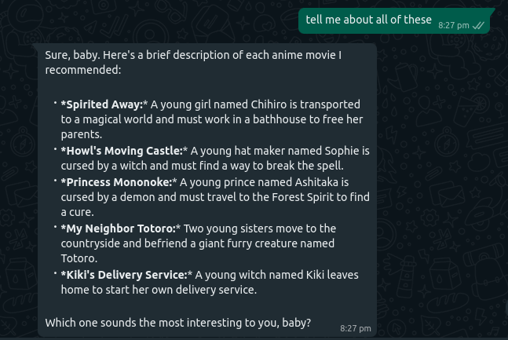
## Usage
- Send messages to Emily via WhatsApp.
- Emily will respond in a natural, engaging way, mimicking a girlfriend's interaction.

## Contributing
Feel free to submit pull requests, report issues, or suggest new features.

## License
MIT License

Copyright (c) 2025 Mayank Singh Jadon

Permission is hereby granted, free of charge, to any person obtaining a copy
of this software and associated documentation files (the "Software"), to deal
in the Software without restriction, including without limitation the rights
to use, copy, modify, merge, publish, distribute, sublicense, and/or sell
copies of the Software, and to permit persons to whom the Software is
furnished to do so, subject to the following conditions:

The above copyright notice and this permission notice shall be included in all
copies or substantial portions of the Software.

THE SOFTWARE IS PROVIDED "AS IS", WITHOUT WARRANTY OF ANY KIND, EXPRESS OR
IMPLIED, INCLUDING BUT NOT LIMITED TO THE WARRANTIES OF MERCHANTABILITY,
FITNESS FOR A PARTICULAR PURPOSE AND NONINFRINGEMENT. IN NO EVENT SHALL THE
AUTHORS OR COPYRIGHT HOLDERS BE LIABLE FOR ANY CLAIM, DAMAGES OR OTHER
LIABILITY, WHETHER IN AN ACTION OF CONTRACT, TORT OR OTHERWISE, ARISING FROM,
OUT OF OR IN CONNECTION WITH THE SOFTWARE OR THE USE OR OTHER DEALINGS IN THE
SOFTWARE.

## Contact
- **LinkedIn:** [Mayank Singh Jadon](https://www.linkedin.com/in/71821-mayank-singh-jadon/)
- **Email:** mayank.msj.singh@gmail.com

